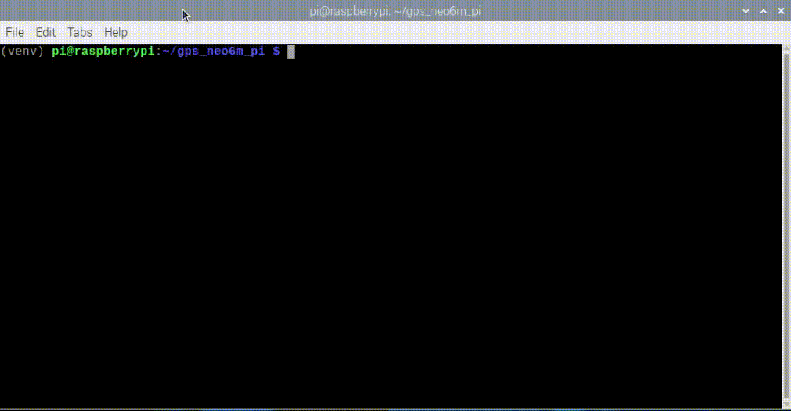

# GPS NEO6M 
Sample of use of GPS Module NEO6M on [Raspberry Pi](https://www.raspberrypi.org/) 




## Getting Started

### Prerequisites
GPS NEO6M hardware connected to Raspberry Pi.

```sh
GPSNEO6M GND -> Raspberry GND
GPSNEO6M TX  -> Raspberry RX (gpio 15)
GPSNEO6M RX  -> Raspberry TX (gpio 14) // Not required
GPSNEO6M VCC -> Raspberry 5v
```


### Installing

Append to /boot/config.txt following code lines:

```sh
dtparam=spi=on
dtoverlay=pi3-disable-bt
core_freq=250
enable_uart=1
force_turbo=1
```

Modify /boot/cmdline.txt to turn off UART as a serial console (due Raspbian behaviour):
```sh
sudo cp /boot/cmdline.txt /boot/cmdline_backup.txt
sudo nano /boot/cmdline.txt
```

WARNING: replace content of cmdline.txt with following but **don't change** old "root" value:
```sh
dwc_otg.lpm_enable=0 console=tty1 root=/dev/mmcblk0p2 rootfstype=ext4 elevator=deadline fsck.repair=yes rootwait quiet splash plymouth.ignore-serial-consoles
```

reboot

Wait some minute to blue led blinking on GPS Module, the run:

```sh
sudo cat /dev/ttyAMA0

```
and verify data.

Now, found which port point to serial port:
```sh
ls -l /dev
```

if output is:
```sh
serial0 -> ttyAMA0
serial1 -> ttyS0
```

we need to execute:
```sh
sudo systemctl stop serial-getty@ttyAMA0.service
sudo systemctl disable serial-getty@ttyAMA0.service
```

otherwise if output is:
```sh
serial0 -> ttyS0
serial1 -> ttyAMA0
```

we need to execute:
```sh
sudo systemctl stop serial-getty@ttyS0.service
sudo systemctl disable serial-getty@ttyS0.service
```

From project root create virtual environment, activate it and install requirements:

```sh
~/gps_neo6m_pi$ python3 -m venv venv
~/gps_neo6m_pi$ source venv/bin/activate
~/gps_neo6m_pi$ pip install -r requirements.txt
```

## Running

```sh
~/gps_neo6m_pi$ python3 start_gps.py

```

## Authors 

Franco Parodi <franco.parodi@aol.com>

## License

This project is licensed under the MIT License.